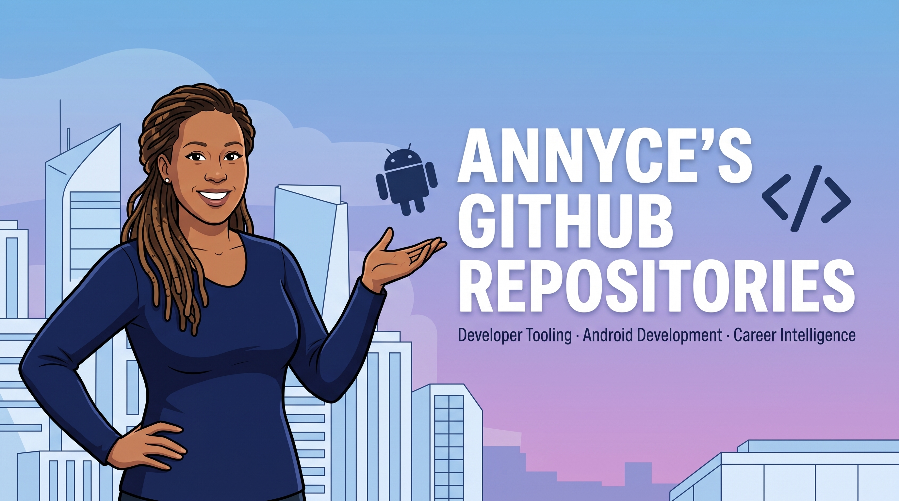

Hey, I'm **Annyce Davis**. Thanks for stopping by! I work as a **Senior Engineering Leader** and **Technology Consultant**. I've specifically focused on helping companies enhance the performance of their engineering teams.

I love creating online training materials. In fact, I’ve created several courses for [LinkedIn Learning](https://www.linkedin.com/learning/instructors/annyce-davis?u=0) that cover multiple subjects related to software engineering.

I hope you find something useful in my little portion of the Internet :wink:

  

## :satellite: Featured Project

[**Invisible Signals™**](https://github.com/invisible-signals/invisible-signals) — Open-source career signal intelligence for engineers and leaders. Detect, refine, and transmit your professional impact in the age of algorithmic hiring.

## :computer: Most popular courses

- [Android Compose with Kotlin](https://www.linkedin.com/learning/android-compose-with-kotlin?u=2125562)
- [Introduction to Career Skills in Software Development](https://www.linkedin.com/learning/introduction-to-career-skills-in-software-development?u=2125562)
- [Tech Career Skills: Effective Technical Communication](https://www.linkedin.com/learning/tech-career-skills-effective-technical-communication?u=2125562)

## :notebook: Latest blog posts
<!-- BLOG-POST-LIST:START -->
- [AI-Augmented Leadership Is Not About Using AI](https://annycedavis.com/2026/04/ai-augmented-leadership-is-not-about-using-ai.html)
- [Jetpack Compose and the Speed of Thinking](https://annycedavis.com/2026/02/jetpack-compose-and-the-speed-of-thinking.html)
- [How I Finally Tamed My Chaotic Files](https://annycedavis.com/2026/02/how-i-finally-tamed-my-chaotic-files.html)
- [A Year of Building, Learning, and Laughing My Way Through AI at Ford](https://annycedavis.com/2025/12/a-year-of-building-learning-and-laughing-my-way-through-ai-at-ford.html)
- [Google I/O 2025: What busy Execs need to know](https://annycedavis.com/2025/06/google-i-o-2025-what-busy-execs-need-to-know.html)
<!-- BLOG-POST-LIST:END -->
