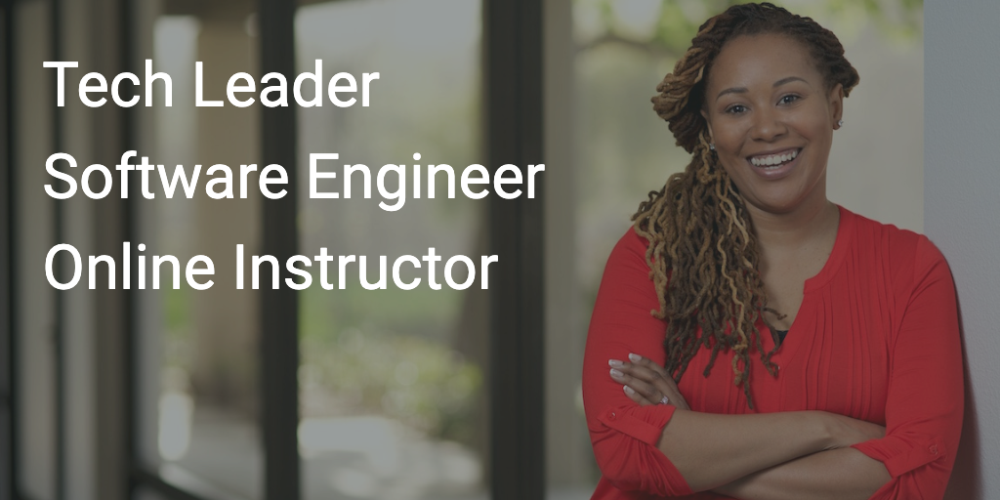

Hey, I’m **Annyce Davis**. Thanks for stopping by! I spend my day-to-day working as an Engineering Leader. I’ve specifically been focused on native mobile applications for over the past decade.

I’m an [Android and Kotlin Google Developer Expert](https://developers.google.com/community/experts/directory/profile/profile-annyce-davis). This means that I spend time developing videos, blog posts, and conference talks for the Developer Community. It’s something that I’m very proud of and passionate about.

I’m currently the **Vice President of Engineering** at [Meetup](https://www.meetup.com/). At Meetup, I help create the future of real community where people show up, do things, and actually talk to each other. Shaping what “mobile-first” means for an established company is both challenging and rewarding.

I love creating online training materials. In fact, I’ve created several courses for [LinkedIn Learning](https://www.linkedin.com/learning/instructors/annyce-davis?u=0) that cover multiple subjects related to software engineering.

I hope you find something useful in my little portion of the Internet :wink:

 

## :computer: Most popular courses
- [Programming Foundations: Fundamentals](https://www.linkedin.com/learning/programming-foundations-fundamentals-3)
- [Tech Career Skills: Effective Technical Communication](https://www.linkedin.com/learning/tech-career-skills-effective-technical-communication?u=0)
- [Android Development Essential Training: 4 Working with Data](https://www.linkedin.com/learning/android-development-essential-training-4-working-with-data/developing-data-driven-apps)

## :notebook: Latest blog posts
<!-- BLOG-POST-LIST:START -->
- [What engineering leaders need to know from this year’s Google I/O](https://adavis.info/2022/05/what-engineering-leaders-need-to-know-from-this-years-google-i-o.html?utm_source=rss&utm_medium=rss&utm_campaign=what-engineering-leaders-need-to-know-from-this-years-google-i-o)
- [Talk: The Real MVP](https://adavis.info/2022/05/talk-the-real-mvp.html?utm_source=rss&utm_medium=rss&utm_campaign=talk-the-real-mvp)
- [Improved caching with Kotlin flows and the reduce function](https://adavis.info/2022/03/improved-caching-with-kotlin-flows-and-the-reduce-function.html?utm_source=rss&utm_medium=rss&utm_campaign=improved-caching-with-kotlin-flows-and-the-reduce-function)
- [Testing Hybrid Jetpack Compose Apps](https://adavis.info/2021/09/testing-hybrid-jetpack-compose-apps.html?utm_source=rss&utm_medium=rss&utm_campaign=testing-hybrid-jetpack-compose-apps)
- [Programmatically laying out views in ConstraintLayout with Flow](https://adavis.info/2021/03/programmatically-laying-out-views-in-constraintlayout-with-flow.html?utm_source=rss&utm_medium=rss&utm_campaign=programmatically-laying-out-views-in-constraintlayout-with-flow)
<!-- BLOG-POST-LIST:END -->